# Project Pnak

Codename Pnak is a action based cooperative tower defense game.

## Table of Contents

- [Play the game](#play-the-game)
- [Project Setup](#project-setup)
- [Contributing](#contributing)

## Play the game

(WIP) You can play the game at [https://pnak.netlify.app/](https://pnak.netlify.app/)

## Project Setup

In order to run the project locally, you'll need to download the project and install the dependencies:

1) **Install [Unity Hub](https://unity.com/download)**: An application that helps you manage Unity projects and UnityEditor versions. It is the recommended way to install and use Unity.
2) **Install UnityEditor 2021.3.25f1**: UI for developer-friendly game dev.

	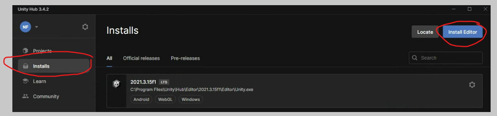 Installs -> Install Editor">

If Unity Hub doesn't show the exact version 2021.3.25f1, you can search for it manually in the "Archive" tab.

	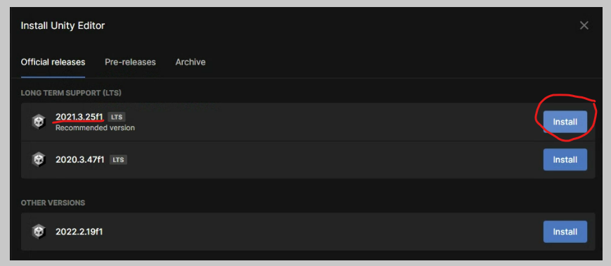

Uncheck Microsoft Visual Studio 2019 and check WebGL Build Support. We will install Visual Studio Code instead. You can choose a different IDE if you want but you may not have access to the same features which will be listed in following steps.

	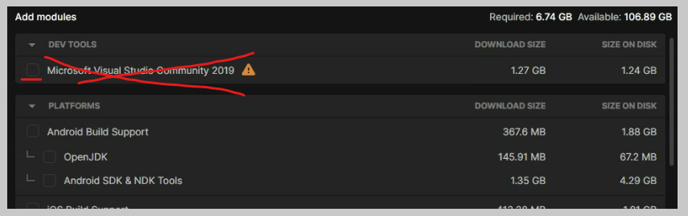

	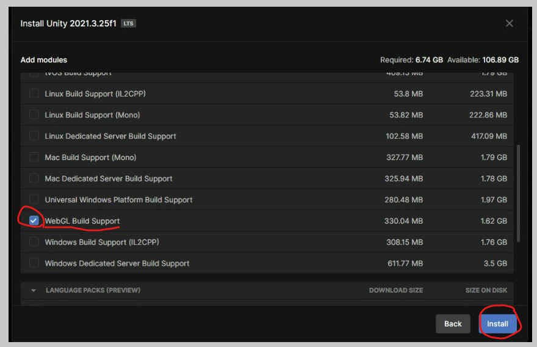

3) **Install [Visual Studio Code](https://code.visualstudio.com/download)**: IDE for all coding needs. Recommended as it has by far the best platform support, including within web browsers.

4) **Setup Unity Development** with Visual Studio Code:

	a) Install the [.NET SDK](https://dotnet.microsoft.com/download)

	b) Restart your computer. This is needed for the .NET SDK to be added to your PATH environment variable, which means your computer will be able to find the .NET SDK when you try to run it.

	c) Open Visual Studio Code and install the [C# extension](https://marketplace.visualstudio.com/items?itemName=ms-dotnettools.csharp)

	d) Disable "omnisharp.useModernNet". To do this, **open the command palette** (Ctrl+Shift+P or F1) and search for "Preferences: Open User Settings". You can also use the shortcut Ctrl+, to open settings. Then, **search for "omnisharp.useModernNet" and uncheck the box**.

	e) Restart Visual Studio Code. Optionally, you can use the command palette (Ctrl+Shift+P or F1) to run the command "Developer: Reload Window".

5) **Install [Git](https://git-scm.com/downloads)**: Version control system for tracking file changes during software development. Useful for backing up and sharing files. While installing, you can choose the default options.

6) **Clone the project**: Cloning is a git term for downloading a repository. There are several ways to do this, but the easiest way is to use Visual Studio Code. Open the command palette (Ctrl+Shift+P or F1) and search for "Git: Clone". Then, copy the URL of this repository by selecting the green "Code" button or by copying the URL of this page. Paste the URL into the VS Code prompt. It will ask you to choose a location to save the project. Once downloaded, it will prompt you to open the project.

	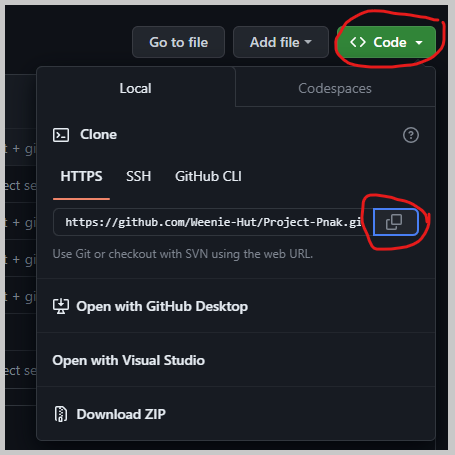

7) **Open the project in Unity**: Open Unity Hub and click "Open" on the projects tab to add a new project (tabs are on the left, "Open" on the top right). Then, navigate to the folder where you cloned the project and select it. Unity will open the project and begin importing assets. This may take a while.

8) (Optional) **Install Useful VS Code Extensions":

	a) Code Spell Checker: Checks spelling in all files with smart suggestions.

	b) Git Graph: Visualizes git history and branches.

	c) Live Share: Collaborate with other developers in real time.

	d) Live Server: Hosts a local web server for testing. Works great with Unity's WebGL build and the Live Share extension.

	e) vscode-icons: Adds icons to files in the explorer tab.

## Updating Your Files

If you have already cloned the project and want to get the latest changes, you can use Visual Studio Code to pull the latest changes from GitHub. Open the command palette (Ctrl+Shift+P or F1) and search for "Git: Pull". This will download the latest changes from GitHub and merge them with your local changes. If you don't want to mess up any of your current changes, you can also use "Git: Fetch" to download the latest changes without merging them. Both of these commands can also be selected from the source control tab in Visual Studio Code.

	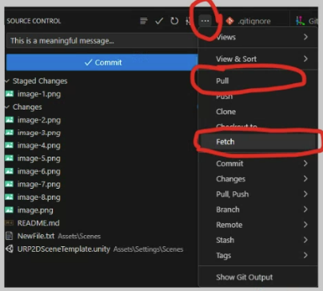

## Contributing

Any files that you add, edit, or delete will automatically be tracked by git. You can see the status of your changes in the Source Control tab in Visual Studio Code. You can also see the files that have changed in the Explorer tab. Files that have been added are green (`U`), files that have been modified are yellow (`M`), and files that have been deleted are red (`D`).

	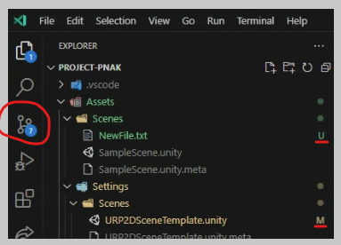

	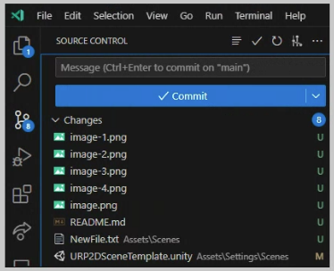

To finalize and share changes, there are three steps:
1) **Stage your changes**: Staging is a git term for choosing which files you want to *commit*. You can stage files by clicking the `+` button next to the file names from inside the soruce control tab. You can also stage all files by clicking the `+` button next to the "Changes" header. You can also undo all changes in a file by clicking the back arrow button next to the file name.

	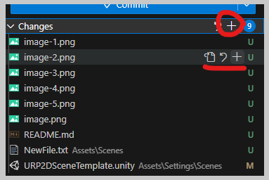

2) **Commit your changes**: Committing is a git term for saving your changes. Commits are always local, meaning they are only saved on your computer. You can commit by entering a commit message and clicking the blue button labeled "Commit".

	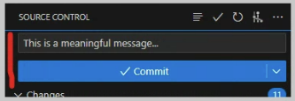

3) If you have completed a commit and there are no current changes, the "Commit" button will be labeled "Sync Changes" instead. CLicking that button will push your commits to the repository on GitHub. This will allow others to see and *fetch* your changes.

	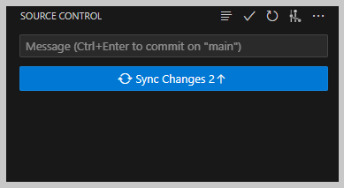

